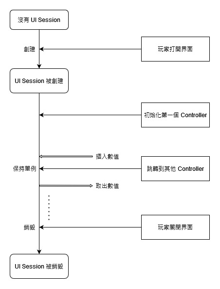

# 快速開始

假若你使用 Maven，則添加以下的依賴:


本框架採用 [github packages](https://github.com/orgs/ELDEpendenci/packages) 作為 maven 庫。你可以在 [這裏 ](https://docs.github.com/en/packages/working-with-a-github-packages-registry/working-with-the-apache-maven-registry#installing-a-package)進一步了解如何掛接。


```markup
<repositories>
    <repository>
        <id>eld</id>
        <url>https://maven.pkg.github.com/ELDependenci/eldependenci-mvc</url>
    </repository>
</repositories>
```

```markup
<dependency>
     <groupId>org.eldependenci</groupId>
     <artifactId>eldependenci-mvc</artifactId>
     <version>{{版本}}</version>
     <scope>provided</scope>
</dependency>
```


注意別忘了先掛接 ELDependenci 的依賴！


完成後，就可以在你的插件中新增一個 Controller Class。

```java
@UIController("main") // controller 的 id
public class MainController {
}
```

要完成設置一個 Controller ，你必須擁有一個初始界面，你可以透過繼承 `View<T>` 去創建一個界面。

```java
// 定義界面
@ViewDescriptor(
        name = "Main View", // 界面標題
        rows = 1, // 界面行數
        patterns = "ZZZZAZZZZ", // 界面的樣式
        cancelMove = 'A' // 需要取消移動的 pattern
)
public class MainView implements View<String> { // 此界面裝載 String 作為數據
    
    @Override
    public void renderView(String s, UIContext uiContext) {
    }
}
```

界面接口 `View<T>` 的 T 代表了數據模型的類型，從實現的方法 `renderView` 中可看到，你將會使用該數據類型一同渲染界面。

```java
// 定義界面
@ViewDescriptor(
        name = "Main View", // 界面標題
        rows = 1, // 界面行數
        patterns = "ZZZZAZZZZ", // 界面的樣式
        cancelMove = 'A' // 需要取消移動的 pattern
)
public class MainView implements View<String> { // 此界面裝載 String 作為數據

    @Override
    public void renderView(String s, UIContext context) {
        ButtonFactory button = context.factory(ButtonFactory.class); //獲取 按鈕組件工廠
        context.pattern('A') // 指定 Pattern A
                .components( // 放入組件
                        button.icon(Material.DIAMOND_BLOCK) // 設置鑽石方塊
                                .title(s) // 設置顯示
                                .create() // 創建組件
                );
    }
}
```

從上述的渲染中，將會創建一個名為 Main View 的一行界面，且在中間欄位會有一個鑽石方塊物品，其名稱則根據由 Controller 傳過來的數值來顯示。

擁有了一個界面之後，那麼現在你可以把它作為你的控制器初始渲染的界面:

```java
@UIController("main") // controller 的 id
public class MainController {
    
    
    // 初始界面渲染，方法名稱必須為 index
    public BukkitView<?, ?> index() {
        String greeting = "hello world!"; // 定義你的數據模型
        return new BukkitView<>(MainView.class, greeting); //連帶 數據模型 返回界面
    }
    
}
```

這樣，上述提及的鑽石方塊物品的顯示名稱將會是 `hello world!`。

你也可以新增自定義的方法參數，例如

```java
@UIController("main")
public class MainController {

    public BukkitView<?, ?> index(Player player) {
        String greeting = "hello, " + player.getName() + "!"; // 將顯示玩家的名稱
        return new BukkitView<>(MainView.class, greeting);
    }

}

```


目前可提供使用的方法參數列表請參閱[這裏](custom-method-controller/available-method-parameters/)。


你也可以回傳異步界面，例如

```java
@UIController("async")
public final class AsyncController {

    @Inject
    private ScheduleService scheduleService;

    @Inject
    private ELDGPlugin plugin;

    public ScheduleService.BukkitPromise<BukkitView<?, ?>> index(){
        return scheduleService.runAsync(plugin, () -> {
            try {
                Thread.sleep(5000); // 等待五秒後回傳界面
            } catch (InterruptedException e) {
                e.printStackTrace();
            }

        }).thenApplySync(v -> new BukkitView<>(AsyncView.class));
    }
}
```


本框架內置了異步加載時的界面渲染，你也可以覆蓋那些設定。


最後，到 Main class 中，取出 `MVCInstallation` 然後註冊你的 Controller，這樣就完成了。

```java
@ELDPlugin(
        registry = TesterRegistry.class,
        lifeCycle = TesterLifeCycle.class
)
public class ELDTester extends ELDBukkitPlugin {


    @Override
    protected void bindServices(ServiceCollection serviceCollection) {
        MVCInstallation mvc = serviceCollection.getInstallation(MVCInstallation.class);
        mvc.registerControllers(MainController.class); // 註冊 Controller
    }

    @Override
    protected void manageProvider(ManagerProvider provider) {

    }
}
```

## 使用

使用極其簡單，可透過 注入 `InventoryService` 使用。

```java
@Commander(
        name = "gui",
        description = "gui command",
        playerOnly = true
)
public class TestGUICommand implements CommandNode {

    @Inject
    private InventoryService inventoryService;

    @Override
    public void execute(CommandSender sender) {
        var player = (Player) sender;
        try {
            UIDispatcher dispatcher = inventoryService.getUIDispatcher("main");
            dispatcher.openFor(player);
        } catch (UINotFoundException e) { // 找不到該界面時
            player.sendMessage("UI not found.");
        }
    }
}
```

## 界面互動處理

目前本框架可以處理的界面有兩種，第一種為點擊事件，第二種則為拖拽事件。

要處理這些事件，你需要在 Controller 新增一個自定義方法，然後標註 `@RequestMapping`

```java
@UIController("main")
public class MainController {

    public BukkitView<?, ?> index(Player player) {
        String greeting = "hello, " + player.getName() + "!"; // 將顯示玩家的名稱
        return new BukkitView<>(MainView.class, greeting);
    }

    @RequestMapping(
            event = InventoryClickEvent.class, //要處理的事件
            pattern = 'A', // 指定 pattern
            view = MainView.class // 指定界面
    )
    public void onClickA(Player player){ //按需定義填入參數
        player.sendMessage("you clicked A item!");
    }

}
```

這樣，點擊鑽石方塊的時候將會向玩家發送消息。

除此之外，你也可以直接使用 `@ClickMapping` 和 `@DragMapping` 來簡化標註需要輸入的參數，例如

```java
@UIController("main")
public class MainController {

    public BukkitView<?, ?> index(Player player) {
        String greeting = "hello, " + player.getName() + "!"; // 將顯示玩家的名稱
        return new BukkitView<>(MainView.class, greeting);
    }

    @ClickMapping(pattern = 'A', view = MainView.class)
    public void onClickA(Player player) {
        player.sendMessage("you clicked A item!");
    }

}
```

### 不指定界面的互動處理 <a href="#anyvieweventhandling" id="anyvieweventhandling"></a>

v0.1.4 之後，你可以不指定界面來捕捉該 Controller 內所有界面的事件傳入。

```java
@UIController("main")
public class MainController {

    public BukkitView<?, ?> index(Player player) {
        String greeting = "hello, " + player.getName() + "!"; // 將顯示玩家的名稱
        return new BukkitView<>(MainView.class, greeting);
    }

    // 透過指定 AnyView.class, 此方法將會捕捉任何界面。
    @ClickMapping(pattern = 'A', view = AnyView.class)
    public void onClickA(Player player) {
        player.sendMessage("you clicked A item!");
    }

}
```

### 跳頁處理

首先，創建一個要被跳轉的界面。

```java
@ViewDescriptor(
        name = "Second View",
        rows = 1,
        patterns = "ZZZZAZZZZ"
)
public class SecondMainView implements View<Void> { //指定 void 類型表示 不需要 數據模型

    @Override
    public void renderView(Void model, UIContext context) {
        ButtonFactory button = context.factory(ButtonFactory.class);
        context.pattern('A')
                .components(
                        button.icon(Material.IRON_AXE)
                                .title("&aYou have successfully jumped to this page!")
                                .create()
                );
    }

}

```

然後，在 Controller class 中指定 pattern A 進行處理，並回傳 `SecondMainView` 。

```java
@UIController("main")
public class MainController {

    public BukkitView<?, ?> index(Player player) {
        String greeting = "hello, " + player.getName() + "!"; // 將顯示玩家的名稱
        return new BukkitView<>(MainView.class, greeting);
    }

    @ClickMapping(pattern = 'A', view = MainView.class)
    public BukkitView<?, ?> onClickA(Player player) {
        player.sendMessage("jumping to second view");
        return new BukkitView<>(SecondMainView.class); // 可以不輸入 model，這個時候 model 將傳回 null
    }

}
```

這樣，當用戶點擊鑽石方塊的時候，將會傳送訊息並跳轉到 `SecondMainView` 上。

### 跳轉到其他 Controller

比起在同一個 Controller 底下傳遞界面，有時候你可能需要傳遞到別的 Controller 去進行界面渲染。

假設你欲傳遞到如下的 Controller:

```java
@UIController("async")
public final class AsyncController {

    @Inject
    private ScheduleService scheduleService;

    @Inject
    private ELDGPlugin plugin;

    public ScheduleService.BukkitPromise<BukkitView<?, ?>> index(){
        return scheduleService.runAsync(plugin, () -> {
            try {
                Thread.sleep(5000);
            } catch (InterruptedException e) {
                e.printStackTrace();
            }

        }).thenApplySync(v -> new BukkitView<>(AsyncView.class));
    }

}
```

則定義點擊處理的時候，需要回傳 `BukkitRedirectView`

```java
@UIController("main")
public class MainController {

    public BukkitView<?, ?> index(Player player) {
        String greeting = "hello, " + player.getName() + "!"; // 將顯示玩家的名稱
        return new BukkitView<>(MainView.class, greeting);
    }

    @ClickMapping(pattern = 'A', view = MainView.class)
    public BukkitView<?, ?> onClickA(Player player) {
        player.sendMessage("jumping to async controller");
        return new BukkitRedirectView("async"); // BukkitRedirectView 繼承了 BukkitView
    }

}
```

這樣，當你點擊鑽石方塊的時候，將會跳傳到 `AsyncController` 然後開始渲染其初始界面。


回傳 null 數值並不會導致報錯，但控制器將不會為你進行任何跳轉。


#### Controller 之間的數據傳遞

相信有一點你可能會注意到的是，跳轉到別的 Controller 時，使用 `BukkitRedirectView` 並沒有可以輸入數據模型的參數，那 Controller 之間該如何傳遞數據？

考慮到這一點，我們受啟發於 ASP .NET / SpringBoot 等 Restful framework，創建了 `UISession` 這個容器。

## UI Session&#x20;

UI Session 類似於 HttpSession，但基於 Minecraft 打開界面者必是玩家，因此沒有匿名 Session 一說。

UI Session 的生命週期如下：



UI Session 從玩家打開第一個界面，到玩家關閉最後一個界面之間一直保持單例，因此可以用來負責數據的傳遞。

```java
@UIController("main")
public class MainController {

    public BukkitView<?, ?> index(Player player) {
        String greeting = "hello, " + player.getName() + "!"; // 將顯示玩家的名稱
        return new BukkitView<>(MainView.class, greeting);
    }

    @ClickMapping(pattern = 'A', view = MainView.class)
    public BukkitView<?, ?> onClickA(Player player, UISession session) {
        player.sendMessage("jumping to async controller");
        session.setAttribute("say", "hello world!"); // 設置 say 數值為 hello world!
        return new BukkitRedirectView("async"); // BukkitRedirectView 繼承了 BukkitView
    }

}
```

然後，便可以在另一個 Controller 透過 UI Session 取出數值

```java
@UIController("async")
public final class AsyncController {

    @Inject
    private ScheduleService scheduleService;

    @Inject
    private ELDGPlugin plugin;

    public ScheduleService.BukkitPromise<BukkitView<?, ?>> index(UISession session){
        String say = session.getAttribute("say"); // 取出 "hello world!"
        return scheduleService.runAsync(plugin, () -> {
            try {
                Thread.sleep(5000);
            } catch (InterruptedException e) {
                e.printStackTrace();
            }

        }).thenApplySync(v -> new BukkitView<>(AsyncView.class));
    }

}
```

UI Session 其可操作的方式大致上跟 Map 一致:

```java
public interface UISession {

    /**
     * 透過 key 獲取數據
     * @param key 鍵
     * @param <T> 數據類型
     * @return 數據，可爲 null
     */
    @Nullable
    <T> T getAttribute(String key);

    /**
     * 透過 key 提取數據並在 Session 中刪除
     * @param key 鍵
     * @param <T> 數據類型
     * @return 數據，可爲 null
     */
    @Nullable
    <T> T pollAttribute(String key);

    /**
     * 設置數據到 Session
     * @param key 鍵
     * @param value 數值
     */
    void setAttribute(String key, Object value);


}
```
